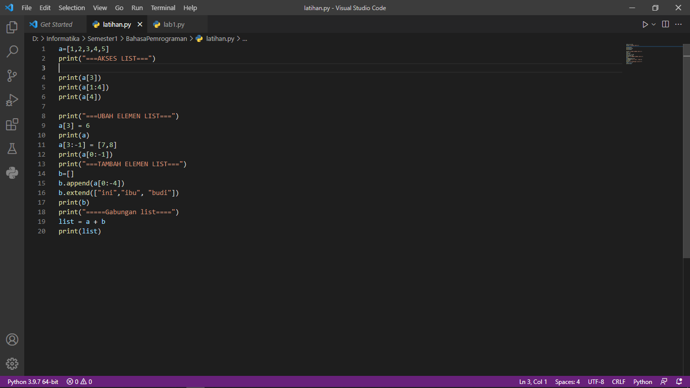
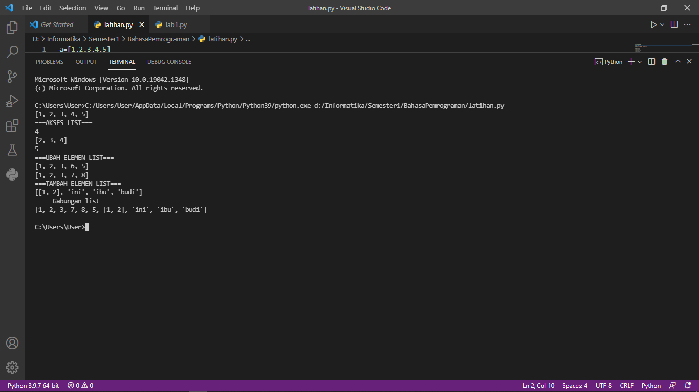
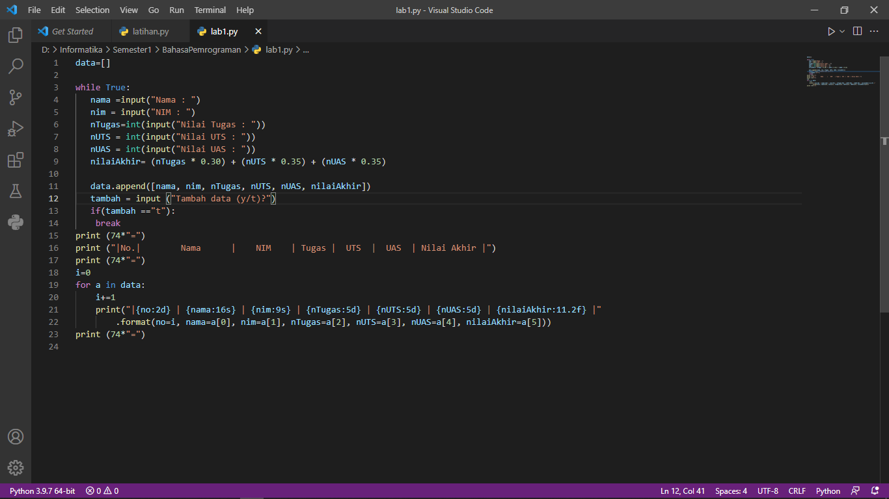
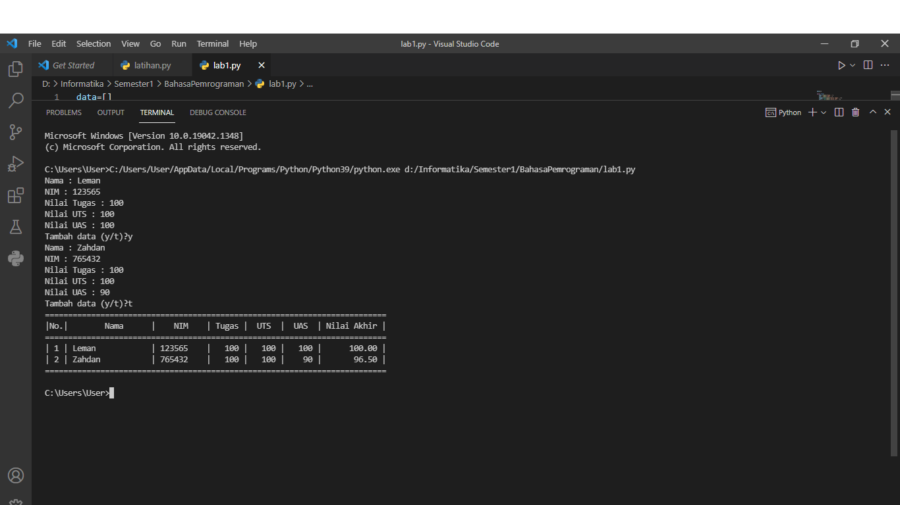

# praktikum4

## latihan akses list, mengubah elemen list, menambahkan elemen list, dan menggabungkan list
berikut adalah source code nya

dan ini adalah hasil ketika program dijalankan

# tugas membuat daftar data nilai
Berikut ini adalah programnya

pertama kita membuat data variabel data yang berisi list kosong
Selanjutnya kita buat perulangan while yang didalamnya terdapat input berupa nama,nim,nTugas,nUTS,nUAS, dan nilaiAKhir. Kemudian kita tambahkan list variabel data tadi menggunakan metode append seperti berikut : data.append([nama, nim, nTugas, nUTS, nUAS, nilaiAkhir]). 
Untuk elemen nilaiAkhir diisi dengan (nTugas * 0.30) + (nUTS * 0.35) + (nUAS * 0.35).
Lalu kita buat pilihan kepada user untuk tambah data atau tidak--> tambah = input ("Tambah data (y/t)?").   jika user menginput y maka program kembali ke perulangan while, jika t maka akan keluar dari perulangan.
kemudian kita membuat tabel manual untuk data dengan source code sebagai berikut:
    print (74*"=")
    print ("|No.|        Nama      |    NIM    | Tugas |  UTS  |  UAS  | Nilai Akhir |")
    print (74*"=")
Lalu tampilkan variabel data yg sudah di input dengan beberapa elemen tadi, banyaknya data tergantung inputan user.
terakhir print (74*"=") untuk penutup tabel

Berikut adalah contoh hasil ketika program dijalankan
